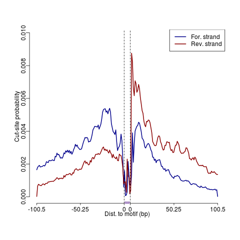
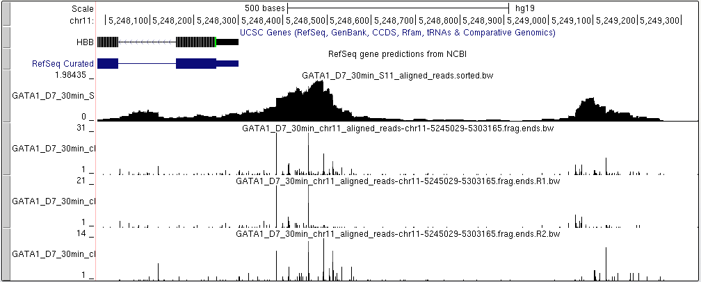

# CutRunTools usage

We provide a small CUT&RUN experiment [qzhudfci/datasets/src](https://bitbucket.org/qzhudfci/datasets/src) that new users can use to test drive our tool. This is GATA1 chr11 only. First put the R1_001 and R2_001 fastq files in a folder and note its path (in my case `/n/scratch2/qz64/Nan_18_aug23/Nan_run_19`). Then write a JSON configuration file (named `config.json`) as shown below.

## Defining a configuration file

CutRunTools requires a JSON configuration file (named as `config.json`) which specifies all that is needed to run an analysis. 
A sample configuration file is below. 

```json
{
	"Rscriptbin": "/n/app/R/3.3.3/bin",
	"pythonbin": "/n/app/python/2.7.12/bin",
	"trimmomaticbin": "/n/app/trimmomatic/0.36/bin",
	"trimmomaticjarfile": "trimmomatic-0.36.jar",
	"bowtie2bin": "/n/app/bowtie2/2.2.9/bin",
	"samtoolsbin": "/n/app/samtools/1.3.1/bin",
	"adapterpath": "/home/qz64/cutrun_pipeline/adapters", 
	"picardbin": "/n/app/picard/2.8.0/bin",
	"picardjarfile": "picard-2.8.0.jar",
	"macs2bin": "/n/app/macs2/2.1.1.20160309/bin",
	"macs2pythonlib": "/n/app/macs2/2.1.1.20160309/lib/python2.7/site-packages",
	"kseqbin": "/home/qz64/cutrun_pipeline", 
	"memebin": "/n/app/meme/4.12.0/bin", 
	"bedopsbin": "/n/app/bedops/2.4.30", 
	"bedtoolsbin": "/n/app/bedtools/2.26.0/bin",
	"makecutmatrixbin": "/home/qz64/.local/bin",
	"bt2idx": "/n/groups/shared_databases/bowtie2_indexes",
	"genome_sequence": "/home/qz64/chrom.hg19/hg19.fa",
	"extratoolsbin": "/home/qz64/cutrun_pipeline", 
	"extrasettings": "/home/qz64/cutrun_pipeline", 
	"input/output": {
		"fastq_directory": "/n/scratch2/qz64/Nan_18_aug23/Nan_run_19",
		"workdir": "/n/scratch2/qz64/workdir",
		"fastq_sequence_length": 42,
		"organism_build": "hg19"
	},
	"motif_finding": {
		"num_bp_from_summit": 150,
		"num_peaks": 5000,
		"total_peaks": 15000,
		"motif_scanning_pval": 0.0005,
		"num_motifs": 20
	},
	"cluster": {
		"email": "johndoe@gmail.com",
		"step_alignment": {
			"queue": "short",
			"memory": 32000,
			"time_limit": "0-12:00"
		},
		"step_process_bam": {
			"queue": "short",
			"memory": 32000,
			"time_limit": "0-12:00"
		},
		"step_motif_find": {
			"queue": "short",
			"memory": 32000,
			"time_limit": "0-12:00"
		},
		"step_footprinting": {
			"queue": "short",
			"memory": 32000,
			"time_limit": "0-12:00"
		}
	}
}
```

By now you should have followed INSTALL.md and successfully installed the prerequisites, so you can skip over lines regarding software installation paths.

The specific settings applicable for a new analysis are: **adapterpath** (line 8), **bt2idx** (line 17); **genome_sequence** (line 18);
section **input/output**: **fastq_directory** (line 22), **workdir** (line 23), **fastq_sequence_length** (line 24),
**organism_build** (line 25); section **cluster**: **email** (line 35).

*  `fastq_directory` is the directory containing paired-end CUT&RUN sequences (should contain _R1_001.fastq.gz and _R2_001.fastq.gz for each sample). 
*  `organism_build` is one of supported genome assemblies: hg38, hg19, mm10, and mm9. 
*  `adapterpath` contains Illumina Truseq3-PE adapter sequences (we provide them). 
*  `genome_sequence` is the whole-genome **masked** sequence which matches with the appropriate organism build.

### Create job submission scripts
```bash
./create_scripts.py config.json
```
This creates a set of Slurm job-submission scripts based on the configuration file above (named config.json) in the `workdir` directory. The scripts can be directly, easily executed.
```bash
./validate.py config.json
```
This script checks that your configuration file is correct and all paths are correct.

### Four-step process for executing CUT&RUNTools

With the scripts created, we can next perform the analysis.

Step 1. **Read trimming, alignment.** We suppose the `workdir` is defined as `/n/scratch2/qz64/workdir`
```bash
cd /n/scratch2/qz64/workdir
sbatch ./integrated.sh GATA1_D7_30min_chr11_R2_001.fastq.gz
```
The parameter is the fastq file. Even though we specify the _R1_001.fastq.gz, CutRunTools actually checks that both forward and reverse fastq files are present. Always use the _R1_001 of the pair as parameter of this command.

Step 2. **BAM processing, peak calling.** It marks duplicates in bam files, and filter fragments by size.
```bash
cd aligned.aug10
sbatch ./integrated.step2.sh GATA1_D7_30min_chr11_aligned_reads.bam
```

Step 3. **Motif finding.** CutRunTools uses MEME-chip for de novo motif finding on sequences surrounding the peak summits.
```bash
cd ../macs2.narrow.aug18
sbatch ./integrate.motif.find.sh GATA1_D7_30min_chr11_aligned_reads_peaks.narrowPeak
```
By default, CutRunTools keeps duplicate fragments. If instead users wish to use deduplicate version, 
```bash
cd ../macs2.narrow.aug18.dedup
sbatch ./integrate.motif.find.sh GATA1_D7_30min_chr11_aligned_reads_peaks.narrowPeak
```

Step 4. **Motif footprinting.**
```bash
cd ../macs2.narrow.aug18
sbatch ./integrate.footprinting.sh GATA1_D7_30min_chr11_aligned_reads_peaks.narrowPeak
```
Beautiful footprinting figures will be located in the directory `fimo.result`. Footprinting figures are created for every motif found by MEME-chip, but only the right motif (associated with TF) will have a proper looking shape. Users can scan through all the motifs' footprints.

# Outputs

CUT&RUNTools generates several outputs including: 1) de novo motifs found by motif searching, 2) aggregate motif footprinting figure, 3) individual motif site binding probability score.

For example, suppose our sample is named "GATA1_D7_30min_S11". We can do the following to access each output.

## De novo motif finding results

```bash
cd macs2.narrow.aug18/random.10000
ls -ltr
```
```
total 4580
drwxrwxr-x 34 qz64 qz64    4096 Dec  2 23:51 MEME_LRF_HDP2_30min_S15_aligned_reads_shuf
-rw-rw-r--  1 qz64 qz64 1033018 Dec  2 23:51 GATA1_D7_30min_S11_aligned_reads_peaks.narrowPeak
drwxrwxr-x  2 qz64 qz64    4096 Dec  2 23:51 summits
drwxrwxr-x  2 qz64 qz64    4096 Dec  2 23:51 padded.fa
drwxrwxr-x 52 qz64 qz64    4096 Dec  2 23:51 MEME_GATA1_D9_30min_S12_aligned_reads_shuf
-rw-rw-r--  1 qz64 qz64  824697 Dec  2 23:51 GATA1_KO_30min_S14_aligned_reads_peaks.narrowPeak
drwxrwxr-x  2 qz64 qz64    4096 Dec  2 23:51 padded
-rw-rw-r--  1 qz64 qz64 1039845 Dec  2 23:51 GATA1_HDP2_30min_S13_aligned_reads_peaks.narrowPeak
drwxrwxr-x 56 qz64 qz64    4096 Dec  2 23:51 MEME_GATA1_HDP2_30min_S13_aligned_reads_shuf
drwxrwxr-x 46 qz64 qz64    4096 Dec  2 23:51 MEME_GATA1_KO_30min_S14_aligned_reads_shuf
-rw-rw-r--  1 qz64 qz64  720325 Dec  2 23:51 LRF_HDP2_30min_S15_aligned_reads_peaks.narrowPeak
-rw-rw-r--  1 qz64 qz64 1030170 Dec  2 23:51 GATA1_D9_30min_S12_aligned_reads_peaks.narrowPeak
drwxrwxr-x 54 qz64 qz64    4096 Dec  3 11:25 MEME_GATA1_D7_30min_S11_aligned_reads_shuf
```

```bash
cd MEME_GATA1_HDP2_30min_S13_aligned_reads_shuf
cat summary.tsv
```

```
MOTIF_INDEX	MOTIF_SOURCE	MOTIF_ID	ALT_ID	CONSENSUS	WIDTH	SITES	E-VALUE	E-VALUE_SOURCE	MOST_SIMILAR_MOTIF_SOURCE	MOST_SIMILAR_MOTIF	URL
1	MEME	AGATAAGV	MEME-1	AGATAAGV	8	410	1.6e-1288	MEME	 	 	 
2	DREME	HGATAA	DREME-1	HGATAA	6	7298	1.8e-1161	DREME	 	 	 
3	DREME	GATAAR	DREME-24	GATAAR	6	321	9.8e-816	DREME	 	 	 
4	DREME	AGATA	DREME-22	AGATA	5	826	4.2e-654	DREME	 	 	 
5	DREME	CWGATA	DREME-14	CWGATA	6	821	1.1e-432	DREME	 	 	 
6	DREME	AGATABS	DREME-4	AGATABS	7	1422	1.4e-147	DREME	 	 	 
7	DREME	CMCRCCC	DREME-2	CMCRCCC	7	1559	5.5e-100	DREME	 	 	 
8	DREME	TGAGTCAB	DREME-3	TGAGTCAB	8	744	2.0e-095	DREME	 	 	 
9	DREME	HGATTA	DREME-7	HGATTA	6	1662	2.7e-091	DREME	 	 	 
10	MEME	TGAGTCAY	MEME-4	TGAGTCAY	8	55	6.5e-082	MEME	 	 	 
11	DREME	RVCCACA	DREME-5	RVCCACA	7	1558	1.4e-045	DREME	 	 	 
12	DREME	CHGCC	DREME-6	CHGCC	5	8862	9.0e-033	DREME
```

The file summary.tsv shows the list of motifs that are found by motif searching.

Download the entire folder `MEME_GATA1_D7_30min_S11_aligned_reads_shuf`. Then go in and open `index.html` to see a comprehensive motif report.


## Motif footprinting result and binding log odds scores

CUT&RUNTools generate motif footprinting plot for each de novo motif that is found by the previous step.
Motif footprinting results are located in `fimo.result` directory.


```bash
pwd
/n/scratch2/qz64/Nan_18_aug28_gata/macs2.narrow.aug18/random.10000/MEME_GATA1_HDP2_30min_S13_aligned_reads_shuf
```

```
cd ../../fimo.result
ls -ltr
```
```
total 20
drwxrwxr-x 38 qz64 qz64 4096 Dec  2 23:51 GATA1_D7_30min_S11_aligned_reads_peaks
drwxrwxr-x 36 qz64 qz64 4096 Dec  2 23:51 GATA1_D9_30min_S12_aligned_reads_peaks
drwxrwxr-x 34 qz64 qz64 4096 Dec  2 23:51 GATA1_KO_30min_S14_aligned_reads_peaks
drwxrwxr-x 19 qz64 qz64 4096 Dec  2 23:51 LRF_HDP2_30min_S15_aligned_reads_peaks
drwxrwxr-x 43 qz64 qz64 4096 Dec  2 23:51 GATA1_HDP2_30min_S13_aligned_reads_peaks
```

The `fimo.result` directory is organized by samples. Within each, you will see the footprints organized by de novo motifs.

```
cd GATA1_HDP2_30min_S13_aligned_reads_peaks/
ls
```
```
fimo2.DREME-10.CCWATCAG  fimo2.DREME-20.CCCTYCC   fimo2.DREME-5.RVCCACA               fimo2.MEME-31.TGGGCASMSTGCCAG
fimo2.DREME-11.CTCCWCCC  fimo2.DREME-21.ASAGGAAG  fimo2.DREME-6.CHGCC                 fimo2.MEME-32.TSAGAGGCAGC
fimo2.DREME-12.CACGTG    fimo2.DREME-22.AGATA     fimo2.DREME-7.HGATTA                fimo2.MEME-39.TTMKCAGCTGGGTRSASCASC
fimo2.DREME-13.CAKCTGB   fimo2.DREME-23.ACAGAMA   fimo2.DREME-8.ACTTCCKB              fimo2.MEME-3.RGGGYGGGGCC
fimo2.DREME-14.CWGATA    fimo2.DREME-24.GATAAR    fimo2.DREME-9.GTTTCY                fimo2.MEME-46.CCYCCTAGTGR
fimo2.DREME-15.CACACASA  fimo2.DREME-25.AAAAAAAA  fimo2.MEME-10.GCCCTGGSYGBTGGC       fimo2.MEME-4.TGAGTCAY
fimo2.DREME-16.CAKTTCC   fimo2.DREME-26.AAACAYA   fimo2.MEME-17.CRGGGRCTGGGCAG        fimo2.MEME-50.GTGGCCAC
fimo2.DREME-17.AGAAAAC   fimo2.DREME-27.CGCADGCG  fimo2.MEME-18.ACCACARACCA           fimo2.MEME-6.CAATTAYTTGVTMAGAGCAAACYWGAAGG
fimo2.DREME-18.GTCAC     fimo2.DREME-2.CMCRCCC    fimo2.MEME-1.AGATAAGV
fimo2.DREME-19.CCAATCGB  fimo2.DREME-3.TGAGTCAB   fimo2.MEME-2.GCAYBCTGGGAADYGTAGTYY
fimo2.DREME-1.HGATAA     fimo2.DREME-4.AGATABS    fimo2.MEME-30.CYTCCCACAGC
```
The ID of each motif corresponds to that in the `summary.tsv` in previous step.
Let us take a look at the motif footprint of HGATAA motif.

```bash
cd fimo2.DREME-1.HGATAA
ls 
```
```
cisml.xml  fimo.bed  fimo.cuts.freq.txt  fimo.gff  fimo.html  fimo.lambda.txt  fimo.logratio.txt  fimo.png  fimo.postpr.txt  fimo.txt  fimo.xml
```

**The file fimo.png contains the motif footprinting figure.**



**The file fimo.logratio.txt shows the posterior binding log-odds score for all motif sites (as shown in fimo.bed file). We can sort all the sites by binding log odds score by the following.**

```
paste fimo.bed fimo.logratio.txt|sort -t $'\t' -g -k7 -r > fimo.logratio.sorted.bed
cat fimo.logratio.sorted.bed
```
```
chr19   51161579        51161585        1-HGATAA-2-chr19        34.5    +       210.558477451988
chr19   51161526        51161532        1-HGATAA-1-chr19        34.5    +       179.033305023544
chr1    33223206        33223212        1-HGATAA-1-chr1 34.5    +       160.872851137722
chr14   103844534       103844540       1-HGATAA-1-chr14        34.5    -       155.321221174099
chr3    25645929        25645935        1-HGATAA-1-chr3 34.5    +       155.278568036591
chr6    10750100        10750106        1-HGATAA-1-chr6 34.5    -       142.401808525619
chr8    40457444        40457450        1-HGATAA-2-chr8 34.5    -       142.322297190559
chr8    27173054        27173060        1-HGATAA-1-chr8 34.5    -       131.213839588474
chr6    42060095        42060101        1-HGATAA-1-chr6 34.5    +       130.3885615178
chr9    6780043 6780049 1-HGATAA-2-chr9 34.5    -       125.950052746736
chr9    6780054 6780060 1-HGATAA-1-chr9 34.5    +       121.898538411992
chr13   52165301        52165307        1-HGATAA-1-chr13        34.5    +       120.932931896737
chr20   44844659        44844665        1-HGATAA-1-chr20        34.5    -       120.231198400945
chr1    114457022       114457028       1-HGATAA-1-chr1 34.5    +       118.77630603718
chr21   46274925        46274931        1-HGATAA-1-chr21        34.5    +       118.382887040806
chr19   10727908        10727914        1-HGATAA-1-chr19        34.5    -       117.173605700489
chr11   27442450        27442456        1-HGATAA-3-chr11        34.5    +       115.467998429997
chr6    3251929 3251935 1-HGATAA-1-chr6 34.5    -       114.091191286861
```
**The last column above shows the binding log odds score.**

In summary, the important output files are located below:
```
macs2.narrow.aug18/random.10000/MEME_GATA1_HDP2_30min_S13_aligned_reads_shuf/summary.tsv
macs2.narrow.aug18/fimo.result/GATA1_HDP2_30min_S13_aligned_reads_peaks/fimo2.DREME-1.HGATAA/fimo.bed
macs2.narrow.aug18/fimo.result/GATA1_HDP2_30min_S13_aligned_reads_peaks/fimo2.DREME-1.HGATAA/fimo.logratio.txt
macs2.narrow.aug18/fimo.result/GATA1_HDP2_30min_S13_aligned_reads_peaks/fimo2.DREME-1.HGATAA/fimo.png
```

## Single locus cut profile

CUT&RUNTools allows users to obtain a single nucleotide resolution cut profile for a region of interest.

This will require a bam file that CUT&RUNTools created (preferrably a bam in `aligned.aug18/dup.marked.120bp` folder), and a region of interest (in the format chr11:5245029-5303165).

The script that is needed is `get_cuts_single_locus.sh`. There is one copy of this in `macs2.narrow.aug18`, and another copy in `macs2.narrow.aug18.dedup`.
Use the former one if you wish to keep duplicates in the bam file (and in the cut profile), or the latter one if you wish to remove duplicates.

```
#construct single locus profile keeping duplicates in bam
cd macs2.narrow.aug18/
./get_cuts_single_locus.sh chr11:5245029-5303165 ../aligned.aug10/dup.marked.120bp/GATA1_D7_30min_chr11_aligned_reads.bam single.locus
```
Here, **the 3 parameters required are: region, bam file path, output directory**. `single.locus` is the output directory.

Once finished, let us check the outputs.

```
cd single.locus
ls -ltr
```

```
-rw-rw-r-- 1 qz64 qz64 306944 Feb  8 22:41 GATA1_D7_30min_chr11_aligned_reads-chr11-5245029-5303165.frag.ends.txt
-rw-rw-r-- 1 qz64 qz64 144936 Feb  8 22:41 GATA1_D7_30min_chr11_aligned_reads-chr11-5245029-5303165.frag.ends.sorted.bed
-rw-rw-r-- 1 qz64 qz64  72468 Feb  8 22:41 GATA1_D7_30min_chr11_aligned_reads-chr11-5245029-5303165.frag.ends.R2.sorted.bed
-rw-rw-r-- 1 qz64 qz64  53822 Feb  8 22:41 GATA1_D7_30min_chr11_aligned_reads-chr11-5245029-5303165.frag.ends.R2.bw
-rw-rw-r-- 1 qz64 qz64  72468 Feb  8 22:41 GATA1_D7_30min_chr11_aligned_reads-chr11-5245029-5303165.frag.ends.R2.bed
-rw-rw-r-- 1 qz64 qz64  34174 Feb  8 22:41 GATA1_D7_30min_chr11_aligned_reads-chr11-5245029-5303165.frag.ends.R2.bdg
-rw-rw-r-- 1 qz64 qz64  72468 Feb  8 22:41 GATA1_D7_30min_chr11_aligned_reads-chr11-5245029-5303165.frag.ends.R1.sorted.bed
-rw-rw-r-- 1 qz64 qz64  45585 Feb  8 22:41 GATA1_D7_30min_chr11_aligned_reads-chr11-5245029-5303165.frag.ends.R1.bw
-rw-rw-r-- 1 qz64 qz64  72468 Feb  8 22:41 GATA1_D7_30min_chr11_aligned_reads-chr11-5245029-5303165.frag.ends.R1.bed
-rw-rw-r-- 1 qz64 qz64  33738 Feb  8 22:41 GATA1_D7_30min_chr11_aligned_reads-chr11-5245029-5303165.frag.ends.R1.bdg
-rw-rw-r-- 1 qz64 qz64 306944 Feb  8 22:41 GATA1_D7_30min_chr11_aligned_reads-chr11-5245029-5303165.frag.ends.checked.txt
-rw-rw-r-- 1 qz64 qz64  58596 Feb  8 22:41 GATA1_D7_30min_chr11_aligned_reads-chr11-5245029-5303165.frag.ends.bw
-rw-rw-r-- 1 qz64 qz64 144936 Feb  8 22:41 GATA1_D7_30min_chr11_aligned_reads-chr11-5245029-5303165.frag.ends.bed
-rw-rw-r-- 1 qz64 qz64  60309 Feb  8 22:41 GATA1_D7_30min_chr11_aligned_reads-chr11-5245029-5303165.frag.ends.bdg
-rw-rw-r-- 1 qz64 qz64   2944 Feb  8 22:41 GATA1_D7_30min_chr11_aligned_reads-chr11-5245029-5303165.bam.bai
-rw-rw-r-- 1 qz64 qz64 188799 Feb  8 22:41 GATA1_D7_30min_chr11_aligned_reads-chr11-5245029-5303165.bam
```

Many of the files in ths folder are intermediary files and can be ignored. The important files are the three bigwigs (`.frag.ends.R1.bw`, `.frag.ends.R2.bw`, and `.frag.ends.bw`). **The R1 and R2 bigwigs designate strand-specific cut profiles that were created. The `frag.ends.bw` is one that combines cuts from both strands.** The bigwigs can be displayed in any visualization tools such as IGV or UCSC genome browser.


